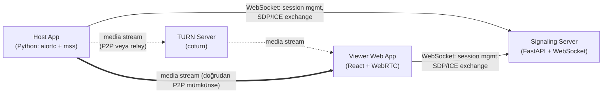
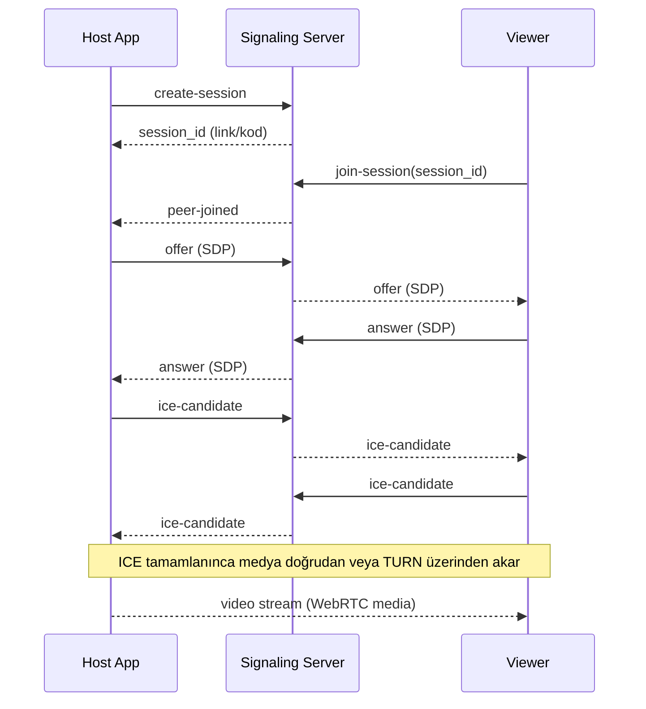

# Architecture

## Components

## Session flow

## Decisions log

- **Native host app, not browser-based**: keeping the host process persistent (no browser tab dependency) and ready for Phase 2 OS-level input injection outweighed the simplicity of a pure browser-to-browser WebRTC app. See design spec for the rejected alternatives (pure-browser, Electron, from-scratch transport).
- **`aiortc` + `mss` over a from-scratch capture/encode pipeline**: WebRTC transport is a solved problem; only the signaling protocol is hand-rolled.
- **In-memory session store, no database**: Phase 1 has no requirement that survives a signaling server restart.
