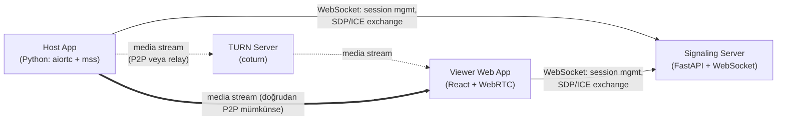
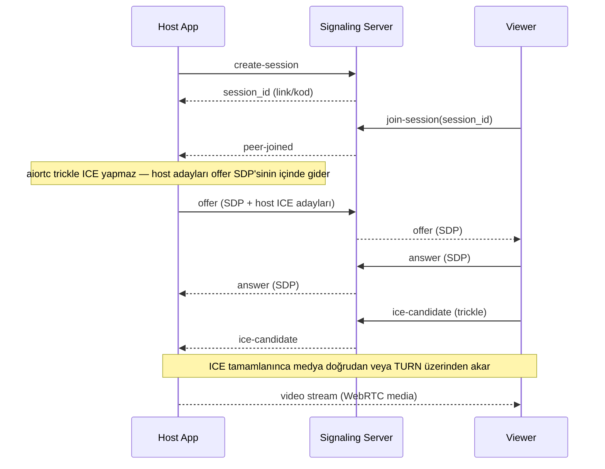

# Architecture

## Components

## Session flow

## Decisions log

- **Native host app, not browser-based**: keeping the host process persistent (no browser tab dependency) and ready for Phase 2 OS-level input injection outweighed the simplicity of a pure browser-to-browser WebRTC app. See design spec for the rejected alternatives (pure-browser, Electron, from-scratch transport).
- **`aiortc` + `mss` over a from-scratch capture/encode pipeline**: WebRTC transport is a solved problem; only the signaling protocol is hand-rolled.
- **In-memory session store, no database**: Phase 1 has no requirement that survives a signaling server restart.
- **Public Google STUN as the baseline ICE server**: both peers always use `stun:stun.l.google.com:19302`, and the self-hosted coturn TURN relay is layered on top only when the `TURN_*` / `VITE_TURN_*` env vars are set — so same-network and cone-NAT setups work with no TURN deployment at all.
- **Device pairing over a persistent `host_id`, not the ephemeral session code**: the session code stays short-lived (5-minute TTL, matches the plan's original UX rationale); a separate, disk-persisted `host_id` lets an already-approved device find its owner's current session without ever seeing a code. This keeps the two concerns — "is this a session worth joining right now" vs. "is this device allowed to join at all" — independent.
- **Pairing approval is a blocking terminal prompt, not a GUI**: matches the host app's existing CLI-only design (§ MVP design spec); a 60-second timeout keeps a pending request from hanging forever if the operator isn't watching.
- **Input kontrolü ayrı bir DataChannel üzerinden, signaling protokolüne dokunmadan**: `RTCDataChannel`, mevcut offer/answer SDP değişimi içinde otomatik müzakere ediliyor — yeni bir WebSocket mesaj tipi gerekmiyor, host'un offer'ı oluşturma sırası (Faz 1'den beri değişmedi) bunu doğal olarak destekliyor.
- **Input yetkilendirmesi = mevcut device pairing onayı, ayrı bir adım yok**: ekranı görebilen bir cihaza ayrıca "kontrol edemez" demenin kendi-cihazların-arası kullanım senaryosunda pratik faydası yok; bilinçli olarak kabul edilen risk (bkz. Faz 2 tasarım spec'i, §0 Güvenlik).
