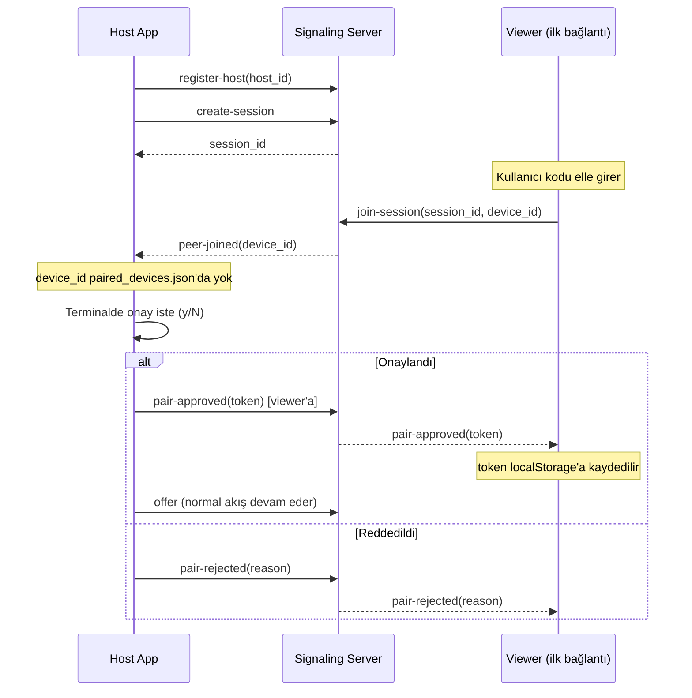
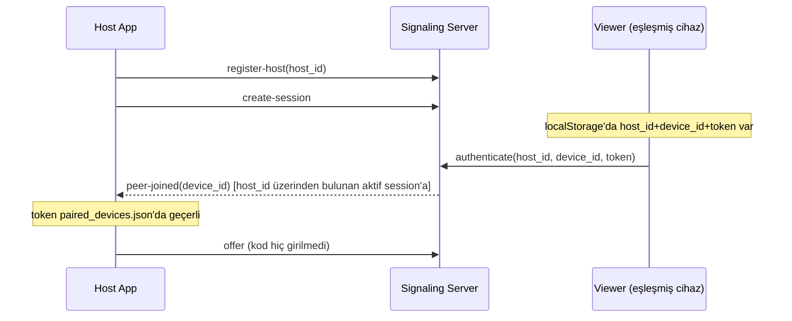

# ScreenTracker — Device Pairing & Deployment Guidance

**Tarih:** 2026-08-17
**Durum:** Onaylandı, implementasyon planı bekleniyor
**Kapsam:** Faz 1'in üzerine — mevcut oturum kodu sistemini bozmadan bir onay/token
katmanı ekler; deployment için Tailscale'i birincil, test edilmiş yol olarak belirler.

## 0. Problem & Gereksinimler

### Problem tanımı

Faz 1'de geçerli bir oturum kodunu bilen **herhangi biri** bağlanabiliyor —
kod kısa ömürlü ve rate-limited olsa da, tek güvenlik katmanı "kodu bilmek".
Kullanıcı, sadece kendisinin açıkça onayladığı cihazların erişebilmesini
istiyor, bir daha kod girmeden.

Ayrıca Faz 1'in deployment planı (Azure App Service + coturn) hem kurulum
hem bakım açısından ağır — kullanıcının asıl ihtiyacı (kendi cihazları
arasında, her yerden erişim) çok daha basit bir yolla (Tailscale mesh VPN)
karşılanabiliyor.

### Fonksiyonel gereksinimler

**Device pairing:**
- İlk bağlantıda (kod + `device_id`), host tanımadığı bir cihaz görürse
  terminalde interaktif onay ister
- Onaylanan cihaza kalıcı bir token verilir, cihaz tarafında (`localStorage`)
  saklanır
- Token'ı olan cihaz sonraki bağlantılarda kod girmeden, host onayı
  beklemeden otomatik bağlanır
- Reddedilen/onaylanmayan cihaz stream'e erişemez
- Birden fazla cihaz eşleştirilebilir (host tarafında bir liste)

**Deployment:**
- Tailscale ile kurulum **test edilmiş, birincil yöntem** olarak dokümante
  edilir (adım adım rehber)
- Azure (App Service + coturn) ve tünel servisleri (ngrok, Cloudflare
  Tunnel) **dokümante edilir ama test edilmemiş, topluluk tarafından
  sürdürülen alternatifler** olarak işaretlenir — sorun çıkarsa issue açma
  veya fork'layıp kendi çözme yönlendirmesiyle

### Fonksiyonel olmayan gereksinimler

- Pairing state'i host tarafında kalıcı (disk), signaling server'da değil —
  signaling server hâlâ stateless/ephemeral (Azure App Service gibi
  ortamlarda yeniden başlatılabilir olmalı)
- Host'un kendi kimliği (`host_id`) oturum kodundan bağımsız, host
  yeniden başlatılsa da sabit kalır
- Pairing isteklerine de mevcut rate limiting uygulanır (yeni bir bypass
  yolu açılmaz)
- Reddedilen/zaman aşımına uğrayan pairing istekleri insan-okunur bir
  mesajla viewer'a bildirilir

## 1. Mimari

### Yeni kavram: `host_id`

Host app ilk çalıştığında `host-app/host_identity.json` içinde kalıcı,
rastgele bir `host_id` üretir (yoksa). Bu, oturum kodundan farklı — host'u
yeniden başlatmalar arasında sabit tanımlayan kimliktir.

### Yeni kavram: paired devices store

`host-app/paired_devices.json` — `{device_id: {token, label, paired_at}}`.
Host süreci içinde bellekte tutulur, her değişiklikte diske yazılır. Hem
`host_identity.json` hem `paired_devices.json` `.gitignore`'a eklenir (kişisel
veri, hiçbir zaman commit edilmez).

### Signaling server: `host_id → aktif session` eşlemesi

Host, `create-session` yerine/yanında `register-host` mesajıyla `host_id`'sini
bildirir; server bu host_id'yi o an aktif oturumla ilişkilendirir (in-memory,
mevcut session store'a ek bir index). Bu, paired (token sahibi) bir cihazın
kod bilmeden "bu host_id'nin aktif oturumuna bağla beni" diyebilmesini sağlar.

### Yeni mesaj tipleri (WebSocket)

| Mesaj | Yön | İçerik |
|---|---|---|
| `register-host` | Host → Server | `host_id: string` |
| `pair-request` | Viewer → Server → Host | `device_id: string`, `label: string` |
| `pair-approved` | Host → Server → Viewer | `token: string` |
| `pair-rejected` | Host → Server → Viewer | `reason: "denied" \| "timeout"` |
| `authenticate` | Viewer → Server → Host | `host_id: string`, `device_id: string`, `token: string` |
| `authenticate-failed` | Host → Server → Viewer | — (viewer, pairing akışına düşer) |

`join-session` mesajı, geriye dönük uyumluluk için aynen kalır — `device_id`
alanı eklenir (opsiyonel; eski istemciler için boş bırakılabilir, ama
viewer-app her zaman gönderecek).

## 2. Akış (Sequence)

## 3. Deployment Dokümantasyonu

`docs/deployment.md` yeni dosya, üç bölüm:

1. **Tailscale (önerilen, test edilmiş)** — adım adım: Tailscale hesabı, PC'ye
   ve telefona kurulum, signaling server'ı Tailscale IP'sinde çalıştırma,
   TURN'e gerek olmadığının açıklaması (Tailscale kendi NAT traversal'ını
   yapıyor, STUN baseline zaten yeterli fallback)
2. **Azure (alternatif, test edilmemiş)** — mevcut planın (App Service +
   coturn Container Instance) özeti, "bu yol test edilmedi" uyarısıyla
3. **Tünel servisleri — ngrok/Cloudflare Tunnel (alternatif, test edilmemiş)**
   — kısa genel bakış

Her iki alternatif bölümün başında: *"Bu yöntem test edilmedi. Sorunla
karşılaşırsan bir issue aç veya repo'yu fork'layıp kendi ortamına göre
uyarlayabilirsin."*

## 4. Hata Yönetimi

- Pairing isteği reddedilirse/zaman aşımına uğrarsa (60s), viewer'a
  insan-okunur mesaj: "Access denied by host." / "Pairing request timed out."
- `authenticate` geçersiz token/device_id ile gelirse → `authenticate-failed`
  → viewer otomatik olarak pairing akışına (kod girme ekranına) düşer
- Host çevrimdışıyken pairing/authenticate isteği gelirse → mevcut
  `session-expired` (`reason: "not-found"`) davranışı korunur

## 5. Test Stratejisi

- `host-app`: `paired_devices.json`/`host_identity.json` okuma-yazma,
  onay prompt'unun non-blocking olması (mock edilmiş `input`)
- `signaling-server`: `register-host`/`pair-request`/`authenticate` mesaj
  akışları, host_id→session eşlemesi, rate limiting'in pairing'e de
  uygulandığı
- `viewer-app`: `localStorage` token yönetimi, pairing bekleme ekranı,
  `authenticate-failed` sonrası kod ekranına düşme

## 6. Kapsam Dışı

- Eşleştirilmiş cihazları listeleyip iptal etmek için bir UI (Faz 1.5'te
  sadece `paired_devices.json`'ı elle düzenlemek yeterli)
- Host'ta grafik arayüzden onay (terminal prompt yeterli)
- Azure/tünel servislerinin otomatik test edilmesi (CI'da sadece Tailscale
  yolu değil, hiçbiri test edilmiyor zaten — bu doküman bölümü sadece
  rehber, otomasyon değil)
