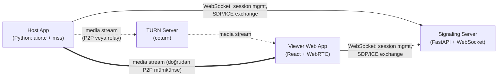
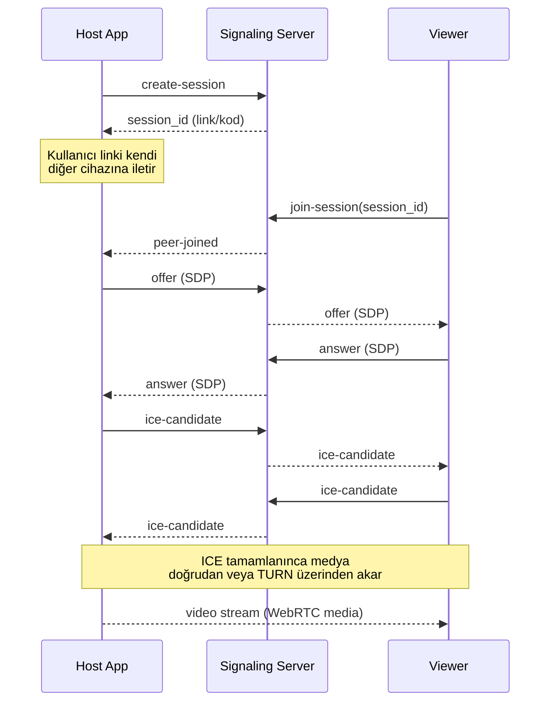

# ScreenTracker — Faz 1 (MVP) Tasarımı

**Tarih:** 2026-08-17
**Durum:** Onaylandı, implementasyon planı bekleniyor

## 0. Problem & Gereksinimler

### Problem tanımı

Kullanıcı kendi PC'sinden fiziksel olarak uzaktayken (farklı ağda/lokasyonda), kendi
diğer cihazlarından (telefon, başka bir PC) PC ekranını görüntüleyemiyor ve kontrol
edemiyor. Hazır ticari araçlar (TeamViewer, AnyDesk) işi çözüyor ama kapalı kaynak ve
öğrenme değeri sunmuyor.

### Fonksiyonel gereksinimler — Faz 1 (bu spec)

- Host cihaz ekranı yakalar, encode eder, stream başlatır
- Benzersiz, tahmin edilemez oturum linki/kodu üretilir
- Viewer (herhangi bir cihaz, tarayıcı üzerinden) linke girip canlı görüntüyü izler
- Farklı ağlardaki (NAT arkası) cihazlar arası bağlantı çalışır (STUN/TURN)

### Fonksiyonel gereksinimler — Faz 2 (bu spec kapsamı dışı, ileride ayrı spec)

- Viewer'daki touch/tıklama girdisinin host'a iletilip OS-seviyesi mouse/klavye
  event'ine çevrilmesi

### Fonksiyonel olmayan gereksinimler

- **Gecikme:** izleme amaçlı, saniyenin altı hedef değil — birkaç saniyeye kadar
  tolerans var (competitive gaming değil)
- **Güvenlik:** yalnızca sahibinin cihazları bağlanabilmeli — oturum kodu/linki
  tahmin edilemez (yeterli entropi), kısa ömürlü (oturum sonlanınca/host kapanınca
  geçersiz)
- **Maliyet:** $0/ay — Azure for Students kredisi + açık kaynak bileşenler
- **Platform:** Host Windows/macOS/Linux, Viewer herhangi bir modern tarayıcı

### İş gereksinimleri

- Amaç: hem WebRTC/network programming öğrenmek hem gerçekten kullanılabilir bir
  araç olsun (portföy + günlük kullanım)
- Açık kaynak, MIT lisans, public GitHub repo
- Hedef kitle: öncelikle projenin sahibi, açık kaynak olduğu için başka
  geliştiriciler de fork/kendi instance'ını kurabilir

### Teknoloji seçimi (gerekçeli)

| Bileşen | Seçim | Neden |
|---|---|---|
| Host app | Python + `aiortc` (WebRTC) + `mss` (ekran yakalama) | `aiortc` WebRTC transport/encode/ICE'ı sıfırdan yazdırmıyor (standart §0.4); `mss` gerçekten çapraz platform |
| Signaling server | Python + FastAPI + WebSocket | Host ile aynı dil, Product Locator'dan zaten FastAPI deneyimi var |
| TURN server | `coturn` (açık kaynak) | NAT arkası bağlantı çözülmüş bir problem, sıfırdan yazılmaz |
| Viewer | React (Vite) + tarayıcı native WebRTC API | Tarayıcı zaten WebRTC client'ı barındırıyor, ek kütüphaneye gerek yok |
| Hosting | Azure App Service (signaling) + küçük VM/Container Instance (coturn) | Doğrulanmış $100 Azure for Students kredisi; coturn kalıcı UDP port istediği için App Service'e uygun değil |

### Sıfırdan mı açık kaynaktan mı (§0.4)

- **WebRTC transport (`aiortc`)** ve **TURN (`coturn`)**: hazır/açık kaynak,
  reinvent edilmiyor — bunlar çözülmüş, karmaşık problemler.
- **Signaling protokolü**: WebRTC standardı signaling'i tanımlamıyor, her uygulama
  kendi mesaj formatını tasarlar — bu küçük ve projeye özel olduğundan sıfırdan
  yazmak makul.
- **Frontend**: React + hazır component kaynakları (shadcn/ui) değerlendirilecek,
  implementasyon planında netleşir.

### Mimari & pattern kararı

Doğası gereği dağıtık bir sistem: host app, signaling server, TURN server, viewer
app farklı cihazlarda/sunucularda çalışmak zorunda — bu "microservices'e zorlama"
değil, gerçek bir zorunluluk. Signaling server tek sorumluluk taşır (oturum
eşleştirme + SDP/ICE mesaj relay), state minimal (in-memory oturum haritası, Faz
1'de kalıcı DB yok).

## 1. Bileşenler

1. **Host App** (Python, arka plan servisi/daemon) — ekran yakalama (`mss`),
   encode + WebRTC peer (`aiortc`), signaling client
2. **Signaling Server** (FastAPI + WebSocket) — session eşleştirme, SDP/ICE mesaj
   relay, in-memory session store
3. **TURN Server** (`coturn`) — NAT arkasındaki cihazlar arası medya relay
   (doğrudan P2P bağlantı kurulamazsa devreye girer)
4. **Viewer Web App** (React/Vite) — session'a katılma, `<video>` ile canlı izleme

## 2. Component Diyagramı

## 3. Veri Akışı (Sequence)

## 4. API Kontratı (WebSocket JSON mesajları)

| Mesaj | Yön | İçerik |
|---|---|---|
| `create-session` | Host → Signal | — |
| `session-created` | Signal → Host | `session_id` |
| `join-session` | Viewer → Signal | `session_id` |
| `peer-joined` | Signal → Host | — |
| `offer` | Host ↔ Signal ↔ Viewer | SDP |
| `answer` | Viewer ↔ Signal ↔ Host | SDP |
| `ice-candidate` | her iki yön | ICE candidate |
| `session-expired` | Signal → Viewer | hata: geçersiz/süresi dolmuş session |
| `peer-disconnected` | Signal → karşı taraf | bağlantı koptu bildirimi |

## 5. Hata Yönetimi

- Session bulunamadı/süresi dolmuş → viewer'a insan-okunur hata, ham detay sadece
  sunucu log'unda
- ICE bağlantısı kurulamadı (TURN'e erişilemedi) → timeout + retry + kullanıcıya
  net mesaj
- Host bağlantısı koptu → viewer'a "host disconnected" bildirimi
- Hiçbir hata sessizce yutulmaz (standart §19)

## 6. Test Stratejisi

- **Signaling server:** pytest unit test — session oluşturma, mesaj yönlendirme
  mantığı, in-memory store
- **Host app:** ekran yakalama ve encode mock'lanarak unit test
- **Viewer:** Vitest (component) + Playwright (e2e akış)
- Gerçek uçtan uca WebRTC bağlantı testi otomatikleştirmesi zor — Faz 1'de manuel
  test + "nice to have" olarak not düşülüyor, ileride ele alınabilir

## 7. Kapsam Dışı (bilinçli olarak Faz 1'e dahil edilmedi)

- Input kontrolü (mouse/klavye) — Faz 2
- Çoklu kullanıcı/davet sistemi (yalnızca kendi cihazların arası bağlantı) — Faz 1
  kapsamında yok, gelecekte ayrı bir karar gerektirir
- Ses aktarımı — Faz 1'de sadece video
- Kalıcı veritabanı — session state in-memory yeterli
